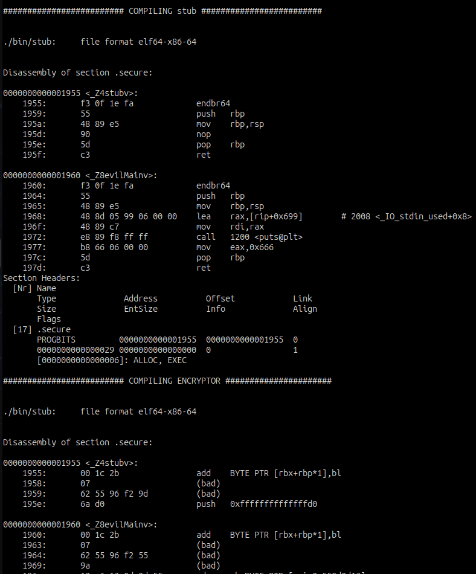

# section_crypter
Project that encrypts the sections with the malicious code in it.

## Usage
Write your code in the stub.cpp file and add the CRYPTER tag before the decrypt part.  
After that encrypt the binary with the section_crypter program.
```sh
make        # Compile code
./test.sh   # Check if the code works.
```

## Example output
